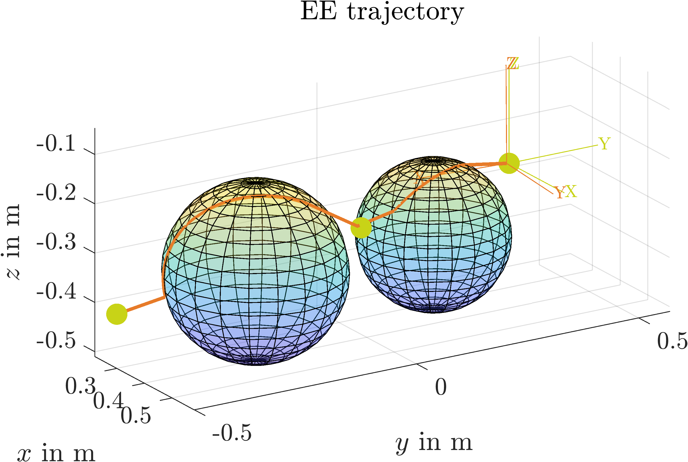
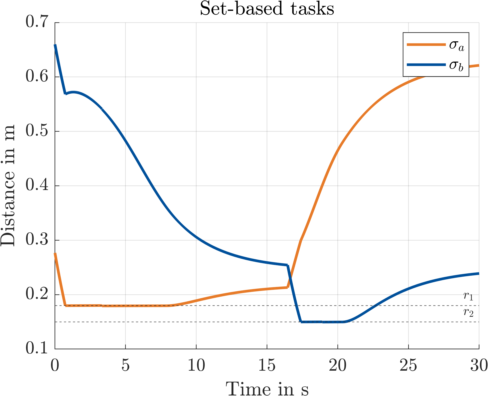
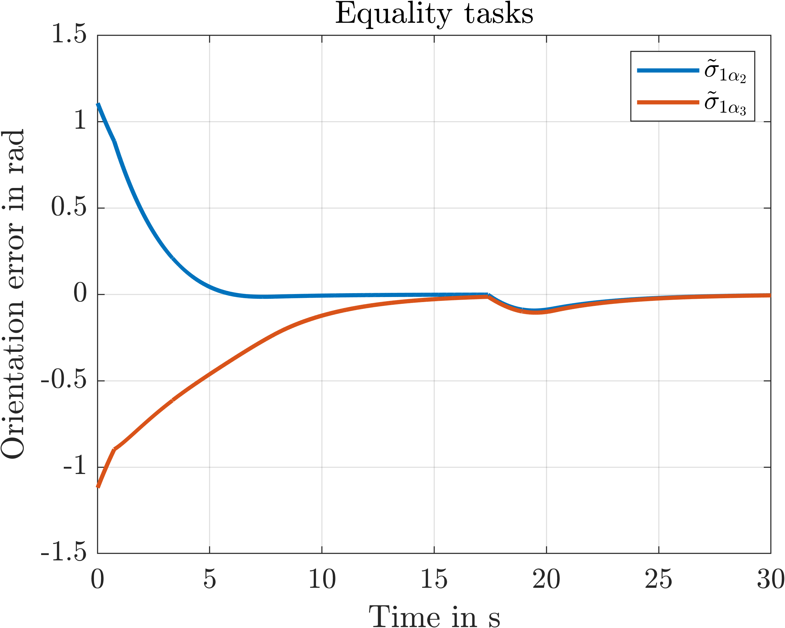
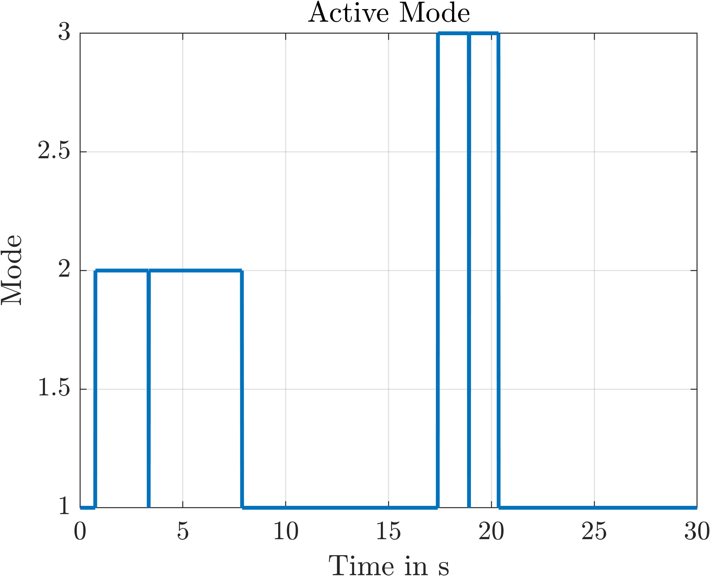

# Set-based Task-Priority Inverse Kinematics Framework

This repository is an implementation of the set-based task-priority inverse kinematics framework published by the research team of Stefano Chiaverini and Gianluca Antonelli. A detailed description can be found in [Moe2016]. Currently, only the relevant case of high-priority set-based tasks with underlying equality-based tasks are possible (no low-priority set-based tasks). The following task definitions have been implemented so far:
- Euclidean distance for collision avoidance or scalar position task
- x,y,z position task (3T)
- Full 6-dimensional position task (3T3R)
- x,y,z position task with additional 2-dimensional orientation (3T2R) task [Schappler2019]
- 2-dimensional orientation (2R) task [Schappler2019]
- Joint limit set-based task (one task per joint)
- Joint limit set-based task with hyperbolical function (one task for all joints)
- Singularity avoidance set-based task to limit condition number of single geometric jacobian or product of several condition numbers (of different geometric jacobians) normalized by number of choosen jacobians
- Singularity avoidance set-based task to limit condition number of single position (3T) jacobian or product of several condition numbers (of different position jacobians) normalized by number of choosen jacobians

## Getting Started
Symbolic Matlab functions of direct kinematics and (geometric) jacobians of the robot are required. Existing toolboxes (e.g. [robsynth-modelgen](https://github.com/SchapplM/robsynth-modelgen)) can be used or alternatively the functions can be created directly in this repo with Maple (change DH-parameters in _fkine_and_jacobians_UR5.mpl_, run the script and convert to Matlab functions with _convertmaple2matlab.py_). The packages [matlab_toolbox](https://github.com/SchapplM/matlab_toolbox), [robotics-dep-ext](https://github.com/SchapplM/robotics-dep-ext) and [robotics-toolbox](https://github.com/SchapplM/robotics-toolbox) are necessary.

## Usage
The complete workflow is shown using an UR5 example similar to [Moe2016]. The following three tasks are considered with descending priority:
- Collision avoidance sigma_a (set-based with _eucl_dist_)
- Collision avoidance sigma_b (set-based with _eucl_dist_)
- Position task sigma_1 (equality with _3T_, _3T3R_ or _3T2R_)

Running the script (_task_prio_UR5.m_) with 3T2R task returns the following plots. Collision avoidance (two spheres as collision objects) is achieved in each iteration, as these tasks have a higher priority than 3T2R positioning.

    
  </a>
    
  </a>

    
  </a>
    
  </a>

</a>
  
</a>

## References
* [Moe2016] Moe, S., Antonelli, G., Teel, A. R., Pettersen, K. Y., Schrimpf, J. (2016): Set-Based Tasks within the Singularity-Robust Multiple Task-Priority Inverse Kinematics Framework: General Formulation, Stability Analysis, and Experimental Results. In: Front. Robot.
* [Schappler2019] Schappler, M., Tappe, S., Ortmaier, T. (2019): Resolution of Functional Redundancy for 3T2R Robot Tasks using Two Sets of Reciprocal Euler Angles. In: Advances in Mechanism and Machine Science.

## Contact
* [Tim-Lukas Habich](https://www.imes.uni-hannover.de/de/institut/team/m-sc-tim-lukas-habich/), Leibniz University Hannover, Institute of Mechatronic Systems (tim-lukas.habich@imes.uni-hannover.de)
